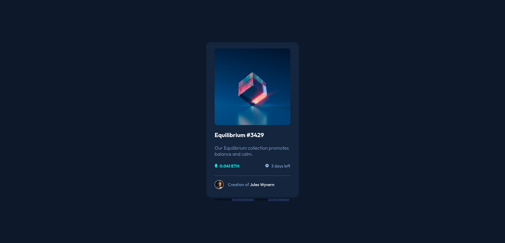

# Overview

This is a solution to the [NFT preview card component challenge on Frontend Mentor](https://www.frontendmentor.io/challenges/nft-preview-card-component-SbdUL_w0U).

The website was done using only:
- Semantic HTML5 markup
- CSS naming convention
- Mobile-first workflow

## Screenshot

## Link to Website (hosted with GitHub Pages)

- [Frontend Mentor Solution URL](https://www.frontendmentor.io/solutions/responsive-landing-page-using-html-vanilla-css-and-js-DQqC0IUnVz)
- [Live Site URL - GitHub Pages](https://cristian-nastase.github.io/FrondendMentor-NFT-preview-card-component/)

## Author
- GitHub: https://github.com/Cristian-Nastase
- Frontend Mentor: https://www.frontendmentor.io/profile/Cristian-Nastase
